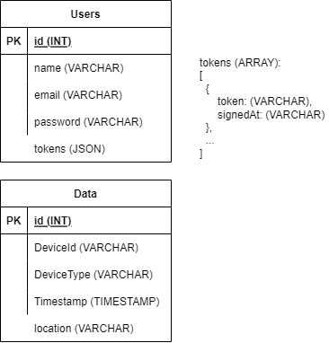

# Solution Doc

In this project, I use the Express Js framework on the backend and the React Js library on the frontend. Communication between client and server is done using the REST API. PostgreSQL is used as a relational database to store and manage data via SQL queries.

The following is the ERD used in this project:

The Users table and the Data table are not made to have a relationship because the user's credential data is only used to login and access data. Furthermore, there is no foreignKey from the Users table in the Data table.

There is a tokens column in the Users table, which is an array to store the user's login token. JsonWebToken is used to generate login tokens, with payload data consisting of email and user ID.

Tokens are used to access data and to log out. When a user logs in, a login token will be generated and stored in the tokens array in the database. The token has an active period of one day and must be renewed after the active period expires. So if the token expires, the user must log in again to be able to access the data. Expired tokens stored in the database will be automatically deleted and updated with new tokens when the user logs in again. With this approach, I don't need a `refresh token` to get a new login token. This token storage method is adapted from [here](https://youtu.be/TO51hGC5zDA).

This project used a pagination system for navigation between pages. The advantages of using pagination queries in this project are a neater page structure, an easier navigation process, and a relatively shorter reload time. Reload time will be faster because the query is limited to a few data.

For further development, features for adding, deleting, and updating data may be needed so that users can not only view GPS data reports.
